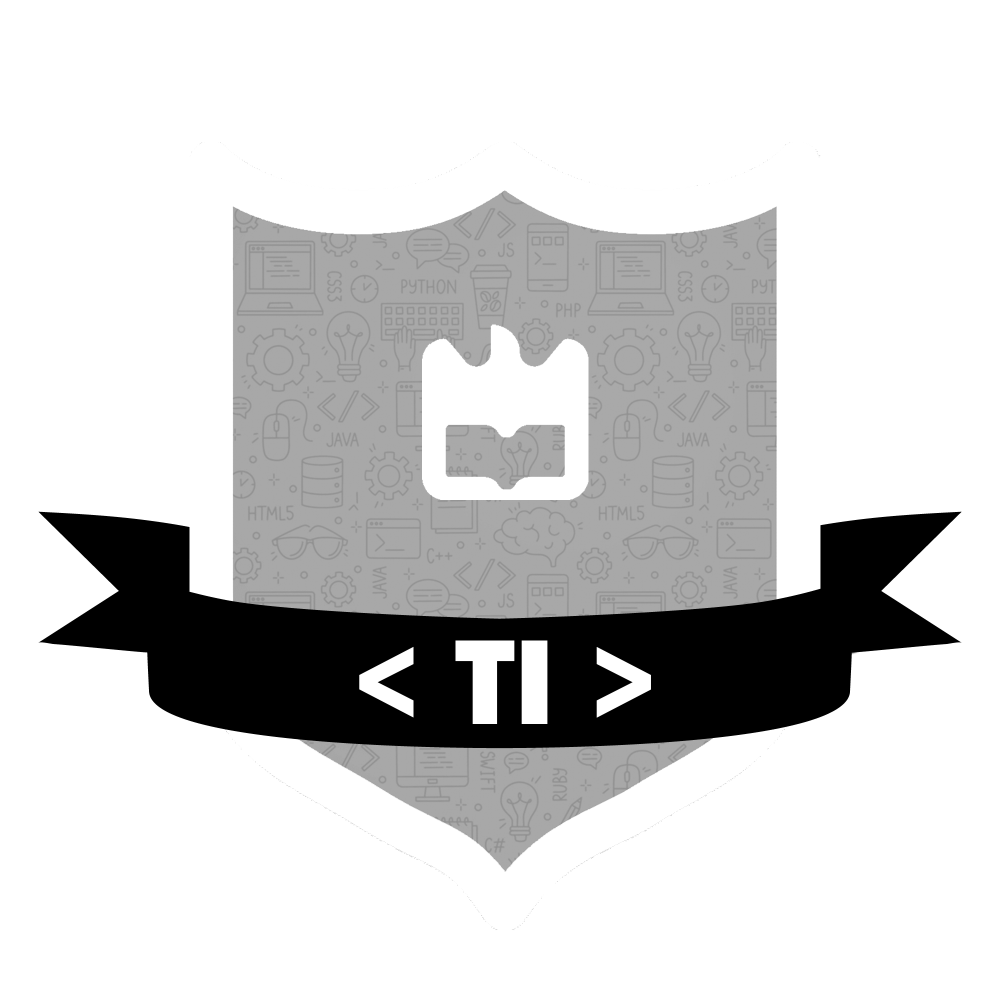

# Licenciatura em Tecnologias da Informação

  

> O curso de Tecnologias da Informação oferece uma formação de base na área da Informática, complementada com formação específica em:

- Desenvolvimento Web
- Telemática
- Geoinformação
- Projetos e estágio integrados

> Durante o curso os alunos participam em projetos desenvolvidos em colaboração com empresas, realizando um estágio final de curso em ambiente empresarial. Com o ensino baseado em projetos, os alunos desenvolvem competências técnicas e outras aptidões importantes para um excelente desempenho profissional, como o trabalho em equipa, a liderança, a capacidade de comunicação e o espírito empreendedor.

<b>Prémios escolares</b>

> O prémio escolar ESTGA-InovaRia é atribuído ao estudante que termina a Licenciatura com a classificação média final mais elevada.

### Organização do Repositório

O repositório está organizado da seguinte forma:
`Dentro de cada pasta está o conteúdo de cada disciplina.`

- 1 ano - 1º Semestre
- 1 ano - 2º Semestre
- 2 ano - 1º Semestre
- 2 ano - 2º Semestre
- 3 ano - 1º Semestre
- 3 ano - 2º Semestre

## 💻 Software

Links dos softwares necessários: 
<b>1º Ano - 2º Semestre</b>
`POO` https://netbeans.apache.org/front/main/index.html 

-------------------------

## 📫 Contribuir para <TI - Code>

Para contribuir com <TI - Code>, siga estas etapas:

<b>No seu terminal, ou no seu IDE, faça os seguintes comandos.</b>
1. `git clone --single-branch --branch desenvolvimento https://github.com/lucasduarte2/TI-Code.git`
2. `git status` - visualiza as alterações feitas dentro do projeto
3. `git add .` - adiciona todos os ficheiros modificados
4. `git commit -m '<mensagem_commit>'` - mensagem do seu commit
5. `git push` envia as suas alterações para o repositório

Como alternativa, consulte a documentação do GitHub em [Sobre o Git](https://docs.github.com/pt/get-started/using-git/about-git).

## 📝 Documentação

Veja o arquivo [Documentação](documentacao.md) para mais detalhes. 
Veja o arquivo [LICENSE](LICENSE) para mais detalhes.